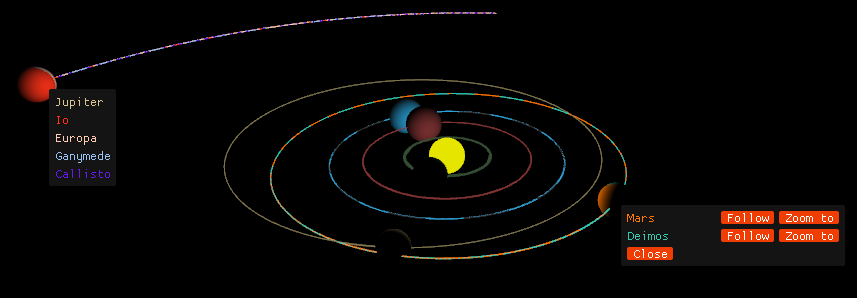
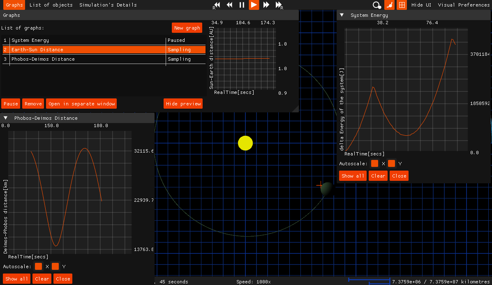
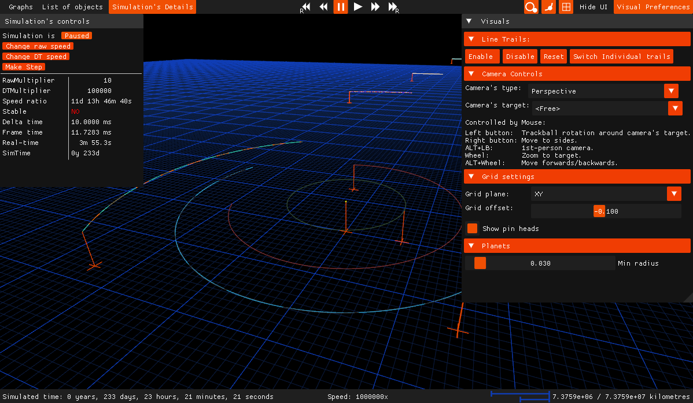

# SolarSystem
SolarSystem is a 3D simulation of the Solar System using numerical integration written in C++ and OpenGL.

The program was written as the final project for a programming class during my first year at Charles University.





### Main Features
1. Written in C++ and OpenGL using [Dear ImGui](https://github.com/ocornut/imgui), [GLAD](https://github.com/Dav1dde/glad), and [GLFW](https://github.com/glfw/glfw) libraries.
2. Explicit and implicit Euler, RungeKutta4 integration methods,
3. Friendly graphical interface,
4. Optionally can load custom star system from a text file.
5. Record and replay functionality (experimental).
# Guide
## Compilation
The project uses CMAKE build system, all necessary resources are copied inside `bin/` directory.

Navigate to the repository's folder:
```
mkdir build && cd build
cmake ../

make
```
Visual Studio 2017+ can open CMake files on its own.

## Command interface
### Usage
    SolarSystem.exe [-mode] [-argKey argValue]

Available modes:
- sim = Standrad simulation
- record = Recorded simulation
- replay = Replays saved simulation
- help = Shows this text.
- [anything else] = Automatic mode

Following is the description of all arguments(M=mandatory,O=optional):
(See documentation for explanation of used terms, only in Czech)
```
- sim:
    -m [simMethod] - O, which method should be used for simulation
                    - available simMethods:
                        euler = explicit Euler
                        semiEuler = semi implicit Euler
                        RK4 - fourth order RungeKutta (default)
    -p [parser] - O, which parser use to obtain simulated data
                - available parsers:
                    solar - hardcoded solar system(default)
                            - has additional arg - see below
                    formatted - FormattedFileParser,
                                - has additional args - see below
    -v [viewer] - O, which viewer is used for viewing of simulation
                - available names:
                    none - EmptyViewer, does nothing
                    win - ImGUIViewer(default)
                        - additional args - see below
    -u [] - O, untimed simulation - see documentation

    -dt ['double' in seconds] - O, deltaTime for Simulation
                                - 10ms default
    -rm ['integer'] - O, raw multiplier
                    - 1 default
    -dm ['integer'] - O, delta time multiplier
                    - 1 default
    -x ['integer' in seconds] - O, max run tim of application in seconds,
                                - 0 for unlimited (default)

- additional arguments for 'formatted' parser:
    -i [input filename] - M, specifies which file is used as input
                        - including path and extension.
    -o [output filename] - O, where should output be saved at
                            - including path and extension.
- additional argument for 'solar' parser:
    -o [output filename] - O, where should output be saved at
                            - including path and extension.
                            - 'formatted' text format will be used.
- additional arguments for 'win' viewer:
    -w ['unsigned integer'] - O, width of window in pixels
                            - 1200default, 1000+ recommended
    -h ['unsigned integer'] - O, height of window in pixels
                            - 700 default, 700+ recommended

- record: 
    all valid arguments for sim except for -u, which si ignored
    -r [record fileName] - M, name of the file, where replay should be saved at
                            - including path and extension.
                            - OVERWRITES any existing file or creates a new one.

- args for replay:
    -r [record fileName] - M, name of the .replay file
                            - including path and extension.

- help [language]: 
            cz Czech version
            en English version(default)

- [other]: Any other string instead of mode is treated as filename.
            If first two bytes of that file are 'R' and 'E' it is assumed to be
            a replay file and replay mode is called with that string as record's filename.
            Otherwise it is treated as formatted text file and passed to sim mode
            with 'formatted' parser and this string as its input file.
```

Here are couple of examples of correct calls to this application:
1. Example: `SolarSystem`
    = Starts timed simulation with 'solar' as parser,'RK4' as simMethod and 'win' as viewer.
        Simulation is played at real-time in 1200x700 window with GUI.

2. `SolarSystem vstup.txt`
    = Timed simulation with 'formatted' as parser,'RK4' as simMethod and 'win' as viewer.
        Simulation is played at real-time in 1200x700 window with GUI.
        (Used [other] mode to determine that, assuming 'vstup.txt' does not start with 'RE'.)
3. `SolarSystem -record -r out.replay -i vstup.txt`
    = Recorded,timed simulation, data loaded from 'vstup.txt',
        record saved at 'out.replay'.
        Rest is same as in 2.Example.
4. `SolarSystem -record -r out.replay -v none -u -m semiEuler -i vstup.txt -o out.txt`
    = Recorded untimed simulation, data loaded from 'vstup.txt', parsed via 'formatted' parser.
        No viewer, simulated using semiImplicitEuler. Recording saved into 'out.replay'.
        Final simulated data are saved to 'out.txt'


## Graphical Interface
### Controls:
- Left mouse button rotates the camera using a trackball.
- Right mouse button pans the cameras.
- ALT+Left button is for looking around.
- Mouse wheel zooms, ALT+wheel moves forward/backwars.


## Code
The best way to describe the code is that it is a product of its time.
It is not always commented as it should be, my CMAKE and git knowledge was rudimentary
so external libraries are copy-pasted. 
There is somewhat detailed documentation written in Czech.
Currently I do not have any intention to develop this project any further.


## LICENSE
External libraries - GLAD, GLFW, ImGui have their own licenses, refer to appropriate readme/license files.

My code uses MIT license.
